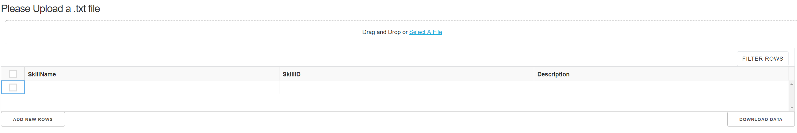
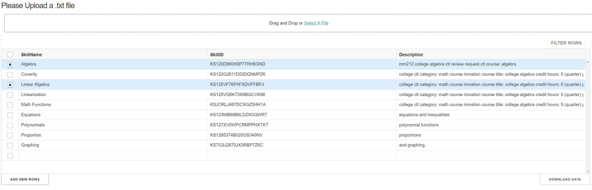

# Personal_Projects

## Skill Parser
This app allows customer to upload resume in .txt file and return a table of skills in a skill taxonomy. 

### Required python packages
- pandas
- base64
- csv
- collections
- nltk
- dash

### Input
A text resume. There is a **test.txt** for testing.

### Output 
A table of skills in **Cleaned_Skillv4_v5_surface_and_standard_form_20180822.csv** matching input file.

### App features
- Allow "Modification to Cells"
  All cells can be *changed* to whatever you think it is better

- "Select Rows Feature"
   This feature allow you to *select correct skills* by clicking on the square in the first column

- "Add New Rows" 
   If a skill is not parsed, you can click on add new rows to *add that skill*. 

### App interface and results
- *App interface*

- *App Result*

